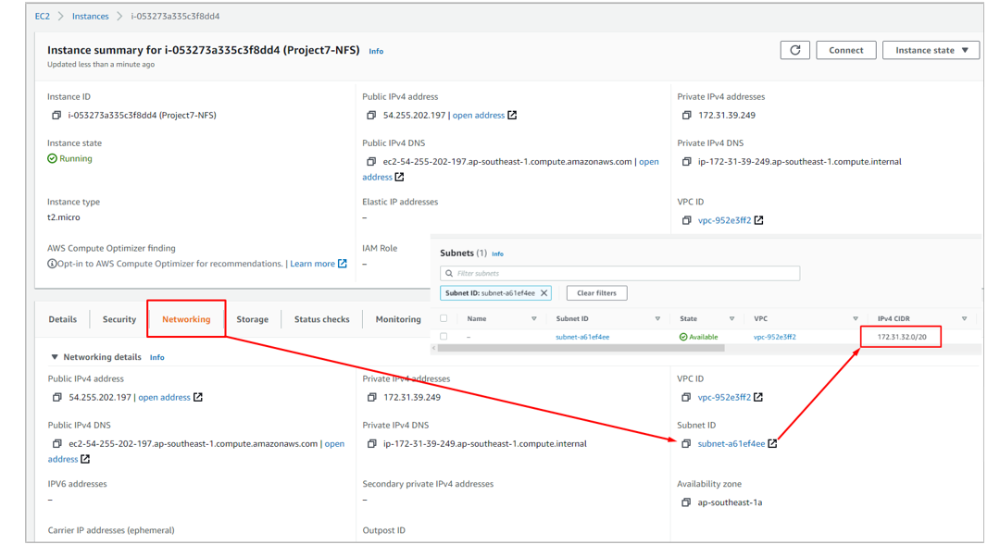
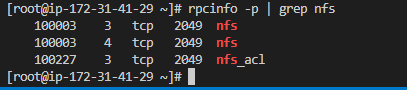
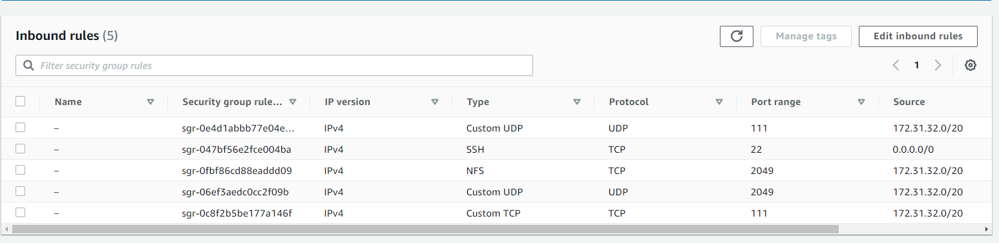

# DEVOPS TOOLING WEBSITE SOLUTION
In this projject I implemented a web solution for a DevOps team using LAMP stack with remote Database and NFS servers

We will use the following components in this project:

-Infrastructure: Amazon Web Services -3 Linux webservers: Red Hat Enterprise Linux 8 -A database system, such as Ubuntu 20.04 and MySQL -Red Hat Enterprise Linux 8 as a storage system -PHP as a programming language -GitHub code source

Examine the architecture of the answer we want to build below:

To start SET UP 

Start four EC2 instances using the RHEL 8 operating system.

Give them the following names: Web1, Web2, Web3, and NFS-svr.

Launch a second EC2 instance running Ubuntu 20.04 with the name DB.-svr

Attach three volumes, each 10 Gib, to the NFS-svr server.

Create volumes according to the directions in [project-6](https://github.com/sammyjel/project-6/blob/main/project-6.md) repository, then attach them to the appropriate instance.

Create the following logical volumes using this [guide](https://github.com/sammyjel/project-6/blob/main/project-6.md):

lv-apps
lv-logs
lv-opt

To act as mount points for the newly formed logical volumes, create the /mnt directory.

Install lv-apps in /mnt/apps. (this will be used by the webbservers)

Install lv-logs in /mnt/logs (this will be used by webserver logs)

Install lv-opt in /mnt/opt (this will be used by jenkins in the next project)

NOTE: If you carefully followed the instructions, running the command `sudo lsblk` should have produced the output shown below.

Using the xfs filesystem, format the logical volume.

`mkfs /dev/webdata-vg/lv-apps -t xfs`

`mkfs /dev/webdata-vg/lv-logs -t xfs`

`mkfs /dev/webdata-vg/lv-opt -t xfs`

Open your NFS-svr terminal and run the following instructions sequentially:

`sudo yum -y update`

`sudo yum install nfs-utils -y`

`sudo systemctl start nfs-server.service`

`sudo systemctl enable nfs-server.service`

`sudo systemctl status nfs-server.service`
Export mounts to connect to webservers' subnet CIDR and install all three webservers in the same subnet for simplicity, but separate each tier into its own subnet in production for higher security.

To verify your subnet `cidr`, visit your EC2 details in the AWS web dashboard, navigate to the 'Networking' tab, and click the Subnet link:
 

`sudo chown -R nobody: /mnt/apps`

`sudo chown -R nobody: /mnt/logs`

`sudo chown -R nobody: /mnt/opt`

Run the following commands to grant the permissions after creating the owner:

`sudo chmod -R 777 /mnt/apps`

`sudo chmod -R 777 /mnt/logs`

`sudo chmod -R 777 /mnt/opt`

Run the following command to restart your nfs server:

`sudo systemctl restart nfs-server.service`

Open the `/etc/exports` file with any text editor, such as `sudo vi /etc/exports`, and paste the following commands to configure access to NFS for clients on the same subnet:

`/mnt/apps <Subnet-CIDR>(rw,sync,no_all_squash,no_root_squash)`

`/mnt/logs <Subnet-CIDR>(rw,sync,no_all_squash,no_root_squash)`

`/mnt/opt <Subnet-CIDR>(rw,sync,no_all_squash,no_root_squash)`

You must use the subnet-cidr from your webserver instance, so keep that in mind.

Run the `sudo exportfs -arv` command after saving and exporting.

Examine the NFS port.

`sudo rpcinfo -p | grep nfs` If everything is in order, the output should look like this:
 

Important information: You must additionally open the following ports for your client to be able to connect to the NFS server: TCP 111, UDP 111, and UDP 2049

## database server configuration

Open a fresh terminal tab and start your database server.

You should be aware that this server runs the Linux operating system Ubuntu.

Install MYSQL on the server by entering the commands `sudo apt install mysql-server -y` and `sudo mysql` to access the console.

start mysql:

`sudo systemctl start mysql`

`sudo systemctl status mysql` to check if mysql is up and running

Create a tooling-themed database account.

CREATE DATABASE tooling;

Create the user webaccess and give it any password you like.

CREATE USER 'webaccess'@'<subnet cidr>' IDENTIFIED BY '<password of your choice>';

Permit webaccess user access.

GRANT ALL ON tooling.* TO 'webaccess'@'<subnet cidr';

FLUSH PRIVILEGES;

SHOW DATABASES;

Next, quit the MySQL console with `exit`

MySQL should be restarted with sudo `systemctl restart mysql`.

## Getting webservers ready

on your computer, launch one of the Webservers, such as web1.

On the server, install the NFS client.

